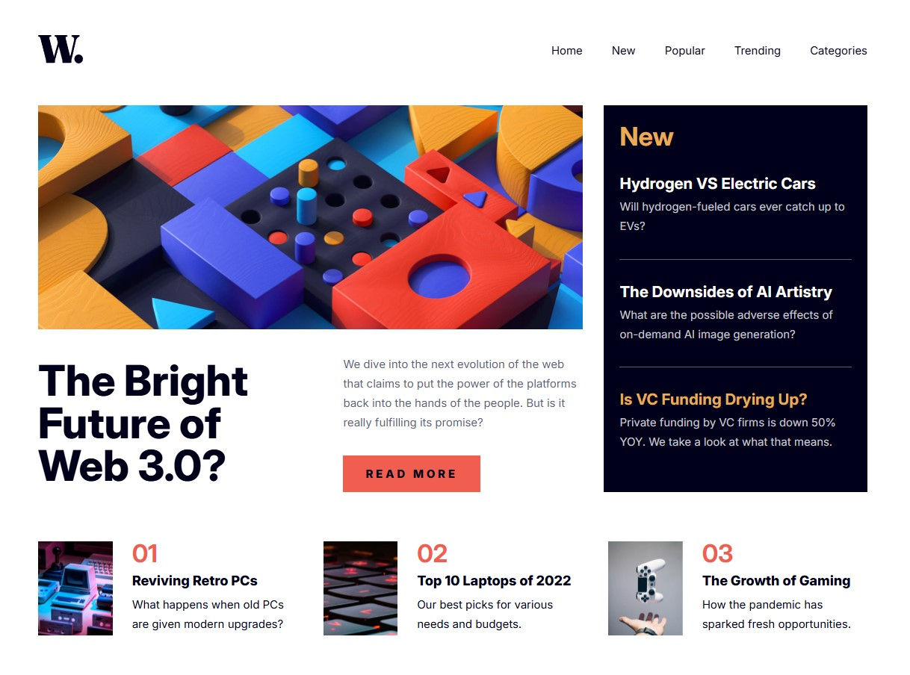

# Frontend Mentor - News homepage solution

This is a solution to the [News homepage challenge on Frontend Mentor](https://www.frontendmentor.io/challenges/news-homepage-H6SWTa1MFl). Frontend Mentor challenges help you improve your coding skills by building realistic projects. 

## Table of contents

- [Overview](#overview)
  - [The challenge](#the-challenge)
  - [Screenshot](#screenshot)
  - [Links](#links)
- [My process](#my-process)
  - [Built with](#built-with)
  - [What I learned](#what-i-learned)
  - [Useful resources](#useful-resources)
- [Author](#author)

## Overview

### The challenge

Users should be able to:

- View the optimal layout for the interface depending on their device's screen size
- See hover and focus states for all interactive elements on the page

### Screenshot

### Links

- Solution URL: [https://github.com/ivan-develops/News-homepage](https://github.com/ivan-develops/News-homepage)
- Live Site URL: [https://ivan-develops.github.io/News-homepage/](https://ivan-develops.github.io/News-homepage/)

## My process

### Built with

- Semantic HTML5 markup
- CSS custom properties
- Flexbox
- CSS Grid
- Mobile-first workflow

### What I learned

Practice using the DOM, apply good user experience with the use of microanimations about _burger menu_.

### Useful resources

- Pixel Perfect Pro - You can trace the design image from the browser

## Author

- Website - [https://github.com/ivan-develops](https://github.com/ivan-develops)
- LinkedIn - [@ivanvargaso](https://www.linkedin.com/in/ivanvargaso/)
- Frontend Mentor - [@ivan-develops](https://www.frontendmentor.io/profile/ivan-develops)